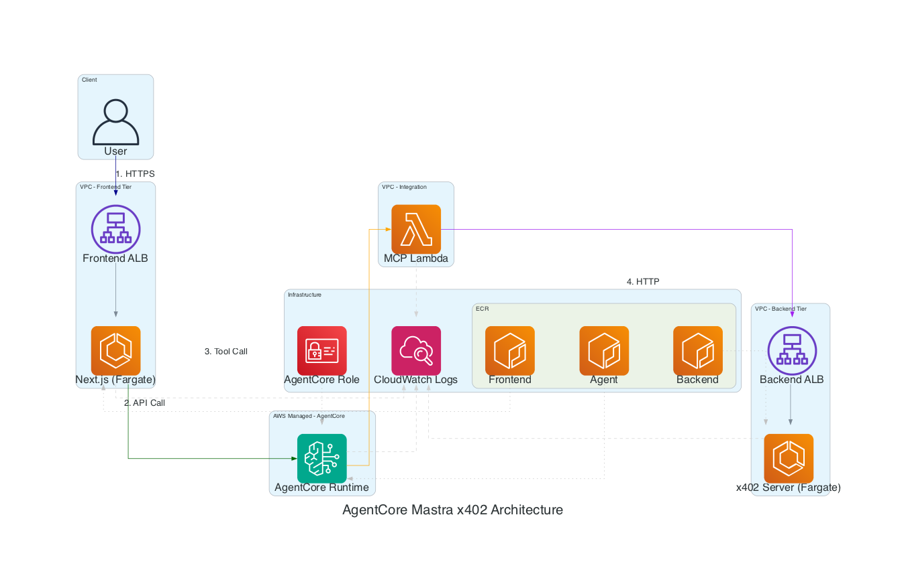
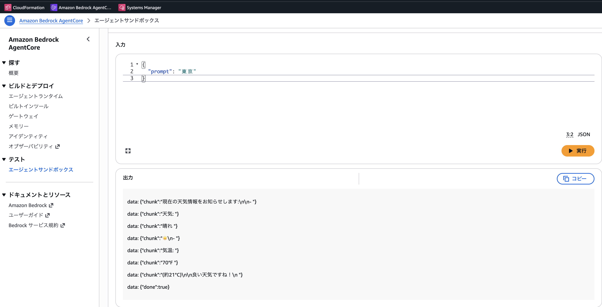
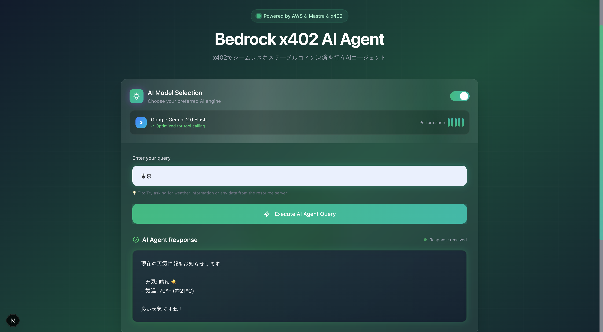
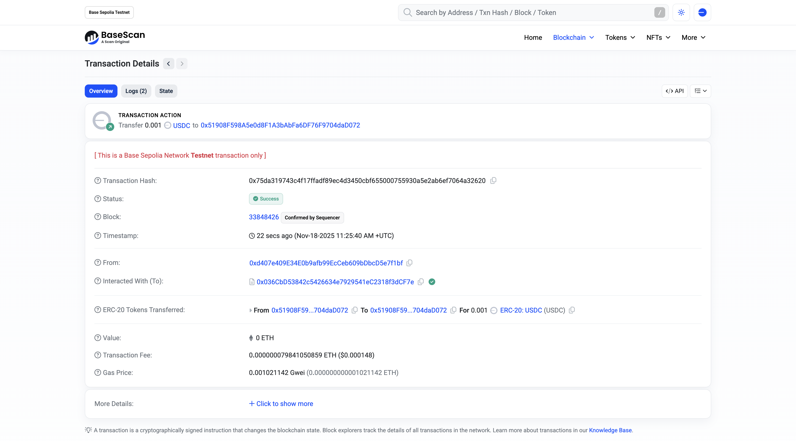

# AgentCore-Mastra-x402
Amazon Bedrock AgentCore Mastra x402でつくる次世代金融AI Agentのサンプル実装です。

## アーキテクチャ



### 設定管理

#### Mastra Agent (AgentCore Runtime)

AWS Systems Manager Parameter Storeを使用して実行時の設定を取得:

**1. MCP Server URL**
- **パラメータ名**: `/agentcore/mastra/mcp-server-url`
- **値**: MCP Server Function URL (デプロイ時に自動設定)
- **用途**: AgentCore RuntimeコンテナがMCPサーバーと通信するためのURL

**2. Google Gemini API Key**
- **パラメータ名**: `/agentcore/mastra/gemini-api-key`
- **値**: Google Generative AI API Key (手動設定が必要)
- **用途**: Geminiモデルを使用する際の認証
- **設定方法**:
  ```bash
  aws ssm put-parameter \
    --name /agentcore/mastra/gemini-api-key \
    --value "YOUR_GOOGLE_API_KEY" \
    --type SecureString \
    --region ap-northeast-1
  ```

#### Frontend (Next.js)

AWS SDK for BedrockAgentCoreを使用してAgentCore Runtimeを呼び出し:

- **環境変数**: `AGENTCORE_RUNTIME_ARN`
- **形式**: `arn:aws:bedrock-agentcore:{region}:{account}:runtime/{runtime-id}/runtime-endpoint/DEFAULT`
- **用途**: フロントエンドがAgentCore RuntimeのInvokeAgentRuntimeCommand APIを呼び出すためのARN
- **認証**: ECS TaskロールのIAM権限を使用

## プロジェクト構成

```
pkgs/
├── mastra-agent/      # Mastra AIエージェント (AgentCore Runtime)
├── mcp/               # MCPサーバー (Lambda)
├── x402server/        # x402バックエンドサーバー (ECS Fargate)
├── frontend/          # Next.jsフロントエンド (ECS Fargate/App Runner)
└── cdk/               # AWS CDKインフラ定義
```

## 動かし方

### インストール

```bash
pnpm install
```

### ブロックチェーン用のキーペアとウォレットアドレスの生成

```bash
pnpm scripts generate:evm-keypair
```

> ここで生成された秘密鍵は`pkgs/scripts/evm-keypair.json`に書き出されます！

### ローカル開発

#### 1. x402サーバーの起動

```bash
pnpm x402server dev
```

#### 2. MCPのビルド

```bash
pnpm mcp build
```

#### 3. Mastra AIエージェントの起動

```bash
pnpm mastra-agent dev
```

#### 4. フロントエンドの起動

```bash
pnpm frontend dev
```

### AWSへのデプロイ

#### 事前準備(Mastra AgentのECRリポジトリ作成とコンテナイメージプッシュ)

> AWS CLIで認証済みであることが必要です！

ECRリポジトリの作成

```bash
aws ecr create-repository --repository-name agentcore-mastra-agent --region ap-northeast-1
```

Mastra製のAI Agent用Dockerイメージのビルド

```bash
# 初回のみ: arm64クロスビルド用のbuilderを準備
pnpm mastra-agent run docker:setup-multiarch

# イメージをビルド
pnpm mastra-agent run docker:build
```

Dockerイメージのタグづけとプッシュ

```bash
export AWS_ACCOUNT_ID=$(aws sts get-caller-identity --query Account --output text)

# ECRログイン
aws ecr get-login-password --region ap-northeast-1 | \
  docker login --username AWS --password-stdin $AWS_ACCOUNT_ID.dkr.ecr.ap-northeast-1.amazonaws.com

# タグ付け
docker tag mastra-agent:latest $AWS_ACCOUNT_ID.dkr.ecr.ap-northeast-1.amazonaws.com/agentcore-mastra-agent:latest

# プッシュ
docker push $AWS_ACCOUNT_ID.dkr.ecr.ap-northeast-1.amazonaws.com/agentcore-mastra-agent:latest
```

#### 事前準備(フロントエンド用のECRリポジトリ作成とコンテナイメージプッシュ)

ECRリポジトリの作成

```bash
aws ecr create-repository --repository-name agentcore-mastra-frontend --region ap-northeast-1
```

Dockerイメージのビルドとプッシュ

```bash
export AWS_ACCOUNT_ID=$(aws sts get-caller-identity --query Account --output text)

# ECRログイン
aws ecr get-login-password --region ap-northeast-1 | \
  docker login --username AWS --password-stdin $AWS_ACCOUNT_ID.dkr.ecr.ap-northeast-1.amazonaws.com

# linux/amd64プラットフォーム向けにビルド (Fargate x86_64用)
cd pkgs/frontend
docker buildx build --platform linux/amd64 \
  -t $AWS_ACCOUNT_ID.dkr.ecr.ap-northeast-1.amazonaws.com/agentcore-mastra-frontend:latest \
  --push .

cd ../..
```

#### 1. MCPサーバーとx402バックエンドをデプロイ

```bash
# MCPをビルド（Lambda用）
pnpm mcp build

# CDKでデプロイ
pnpm cdk run deploy 'AgentCoreMastraX402Stack'
```

#### 2. SSM パラメータストアへの環境変数追加設定

以下の値について、パラメータストアに環境変数を設定してください。

- `MCP_SERVER_URL`
- `GOOGLE_GENERATIVE_AI_API_KEY`

### デプロイ後にAmazon Bedrock AgentCore Runtimeでテストする際のテストデータ

```json
{
  "prompt": "東京"
}
```

### AWSリソースを削除

```bash
pnpm cdk run destroy 'AgentCoreMastraX402Stack' --force
```

### ECRにプッシュしたコンテナリポジトリ＆イメージは別途削除が必要

```bash
# x402-backend-api
aws ecr delete-repository \
  --repository-name x402-backend-api \
  --force --region ap-northeast-1

# agentcore-mastra-frontend
aws ecr delete-repository \
  --repository-name agentcore-mastra-frontend \
  --force --region ap-northeast-1

# agentcore-mastra-agent
aws ecr delete-repository \
  --repository-name agentcore-mastra-agent \
  --force --region ap-northeast-1
```

## CI パイプライン

このプロジェクトでは、GitHub Actionsを使用したCIパイプラインを実装しています。

### 自動化されたワークフロー

#### 🔍 CI Pipeline
- **実行タイミング**: プルリクエスト作成時、mainブランチへのマージ時
- **実行内容**:
  - コード品質チェック (Biome)
  - TypeScript型チェック
  - 全パッケージのビルド
  - ユニットテスト
  - Dockerイメージビルドテスト
  - セキュリティ監査

詳細は[`.github/workflows/ci.yml`](./.github/workflows/ci.yml)を参照してください。

## 各パッケージの詳細

- **mastra-agent**: [README](./pkgs/mastra-agent/README.md)
- **mcp**: [README](./pkgs/mcp/README.md)
- **x402server**: [README](./pkgs/x402server/README.md)
- **frontend**: [README](./pkgs/frontend/README.md)
- **cdk**: [README](./pkgs/cdk/README.md)

## AgentCore Runtime サンドボックスでのテスト結果



## フロントエンドのイメージと



## ステーブルコイン決済履歴



## 参考文献
- [AI Builders Day プレイベント資料](https://speakerdeck.com/mashharuki/amazon-bedrock-agentcore-x-aws-cdk-x-mastra-x-x402-deci-shi-dai-jin-rong-ai-agentwozuo-rou)
- [2025年のキャッシュレス決済比率を算出しました](https://www.meti.go.jp/press/2025/03/20260331006/20260331006.html)
- [「ステーブルコイン決済は低コスト」という神話を検証する](https://note.com/decentier/n/ned0047c30094)
- [Amazon Bedrock AgentCoreとCDKとMastraとx402で構築する金融AIエージェント！](https://zenn.dev/mashharuki/articles/x402_agentcore-1)