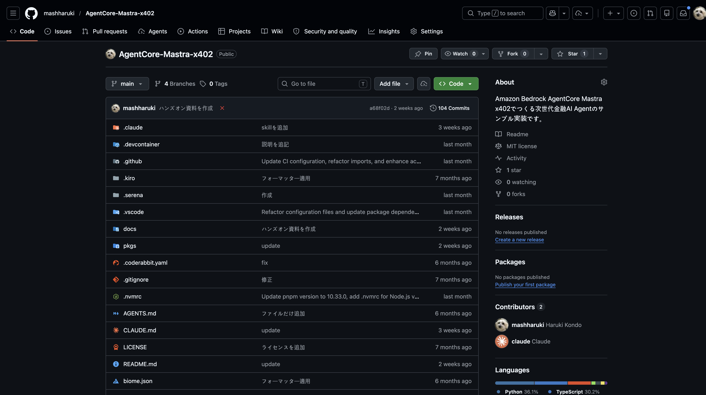
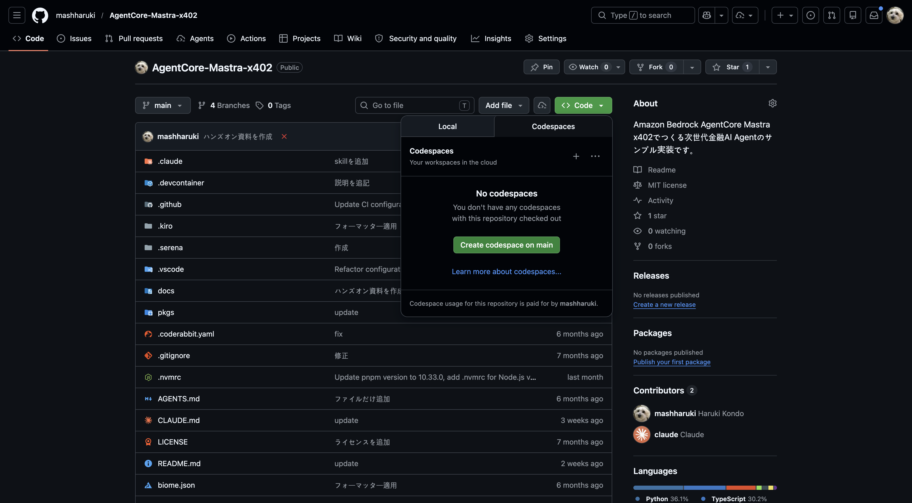
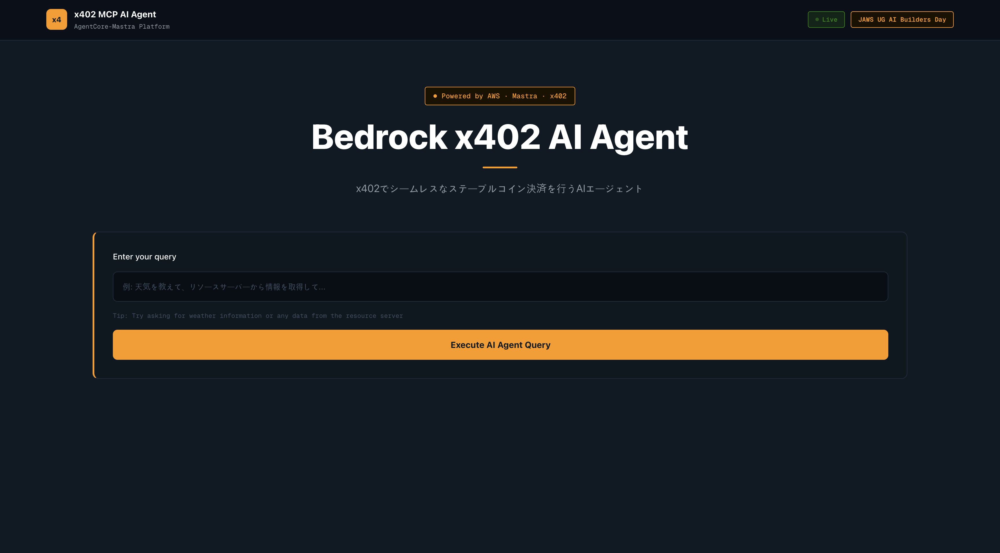
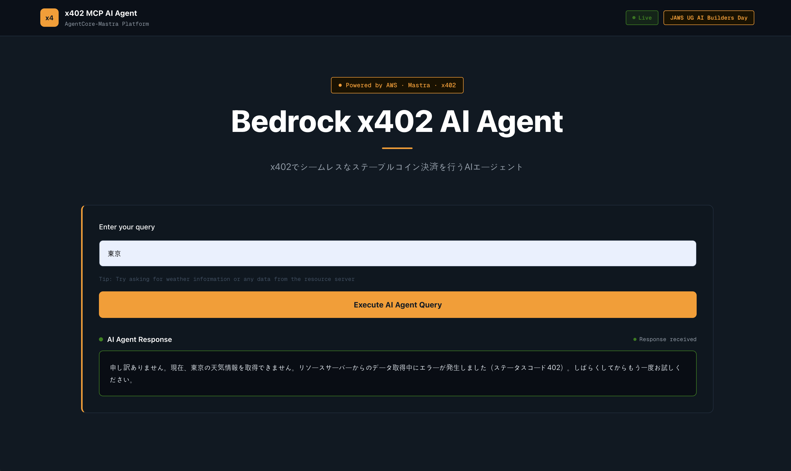
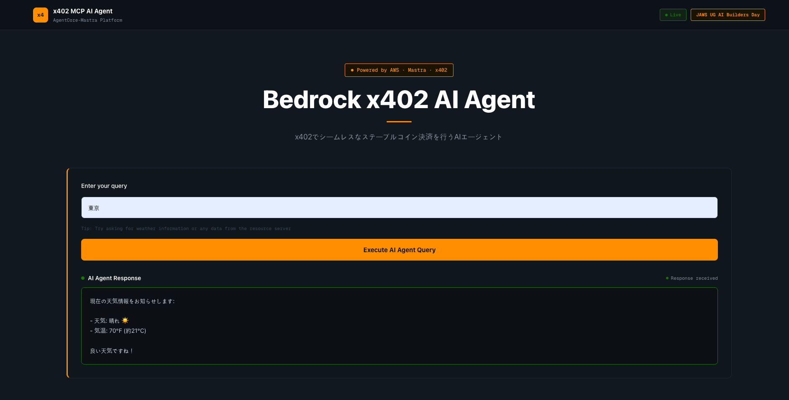

# ハンズオン手順書

> 2026年5月18日 動作確認済み！

## 座学編のスライドのリンク

[Canva スライド資料](https://canva.link/vxh8njtfiklh8gc)

## GiHub リポジトリを自分のアカウントにフォークする

フォーク対象のリポジトリは以下です。

https://github.com/mashharuki/AgentCore-Mastra-x402

右上の「Fork」ボタンを押します。



## GitHub CodeSpacesを起動する

> DevContainerの環境もセットアップする関係で少し時間がかかります！

フォークしてきたら緑色の「Codes」ボタン押して右側の「CodeSpaces」ボタンを押します。

その後「Create CodeSpaces on main」ボタンを押せばOKです！



## 依存関係のインストール

```bash
pnpm install
```

## Web3ウォレット用の秘密鍵・ウォレットアドレスを生成する

```bash
pnpm scripts generate:evm-keypair
```

以下のようになればOK!

```json
{
  "privateKey": "0x...",
  "walletAddress": "0x..."
}
```

## 生成されたウォレットアドレスをGoogle フォームに入力してください

> テストネット用の暗号資産を配布するのでウォレットアドレスを入力してください

[Googleフォーム - 2026年5月26日_AWS_x402_ワークショップ](https://docs.google.com/forms/d/e/1FAIpQLScTAUkOI1CxvOL617N-SSUILSWYqW8q9jrIBiDXM8Jwl46eUQ/viewform)

作成されたウォレットアドレスに少額の**ETH**と**USDC**を送ります。

以下のサイトで自分のウォレットアドレスを入力して検索し、残高が増えていることを確認してください。

[Base Sepoliaのブロックエクスプローラー](https://sepolia.basescan.org/)

## Google AI StudioでAPIキーを生成する

以下のリンクから **Google AI Studio** にアクセスし、新しいプロジェクトを作成する。

https://aistudio.google.com/projects

そしてAPIキーをfreeプランで生成します。

## 環境変数のセットアップ

```bash
cp ./pkgs/cdk/.env.example ./pkgs/cdk/.env
```

以下の値を設定します。

```bash
FACILITATOR_URL=https://x402.org/facilitator
NETWORK=base-sepolia
ENDPOINT_PATH=/weather
ADDRESS=0xe6AA1B60c4EC760668dB3C06d7A894c5Fd39D0aa
PRIVATE_KEY=<上記で生成されたものを貼り付ける>
GOOGLE_GENERATIVE_AI_API_KEY=<Google AI Studioで生成したものを貼り付ける>
```

## MCPサーバーのビルド

```bash
pnpm mcp build
```

## CDKスタックのデプロイ

```bash
# 初めてCDKを使う場合は以下のコマンドも実行すること(pkgs/cdk ディレクトリ配下で実行する必要あり)
cdk bootstrap

# CDKでデプロイ(以下のコマンドはルートディレクトリで実行する必要あり)
# 事前にCloudFormationのテンプレートファイルを確認した場合には以下を実行
pnpm cdk run synth

# CDKスタックで一括デプロイ
pnpm cdk run deploy 'AgentCoreMastraX402Stack'
```

デプロイが完了すると以下のリソースが出力として表示されます。

```bash

 ✅  AgentCoreMastraX402Stack

✨  Deployment time: 313.45s

Outputs:
AgentCoreMastraX402Stack.AgentCoreMastraAgentEcrRepositoryUri = 
AgentCoreMastraX402Stack.AgentCoreMastraEndpointArn = 
AgentCoreMastraX402Stack.AgentCoreMastraFrontendEcrRepositoryUri = 
AgentCoreMastraX402Stack.AgentCoreMastraFrontendServiceLoadBalancerDNS6A45A997 = 
AgentCoreMastraX402Stack.AgentCoreMastraFrontendServiceServiceURLB3967C4A = 
AgentCoreMastraX402Stack.AgentCoreMastraFrontendUrl = 
AgentCoreMastraX402Stack.AgentCoreMastraRuntimeArn = 
AgentCoreMastraX402Stack.AgentCoreMastraRuntimeId = 
AgentCoreMastraX402Stack.AgentCoreMastraRuntimeRegion = 
AgentCoreMastraX402Stack.AgentCoreMastraX402BackendApiUrl = 
AgentCoreMastraX402Stack.AgentCoreMastraX402BackendServiceLoadBalancerDNSA5E88881 = 
AgentCoreMastraX402Stack.AgentCoreMastraX402BackendServiceServiceURL21E71FD4 = 
AgentCoreMastraX402Stack.AgentCoreMastraX402GeminiApiKeyParameter = 
AgentCoreMastraX402Stack.AgentCoreMastraX402MCPServerUrl = 
AgentCoreMastraX402Stack.AgentCoreMastraX402MCPServerUrlParameter = 
AgentCoreMastraX402Stack.AgentCoreMastraX402MCPServerUrlParameterArn = 
AgentCoreMastraX402Stack.AgentCoreMastraX402VpcId = 
```

## 動作確認

### デプロイ後にAmazon Bedrock AgentCore Runtimeでテストする際のテストデータ

```json
{
  "prompt": "東京"
}
```

以下になればOK!


### フロントエンドから動作確認する

#### フロントエンドのイメージ



#### フロントエンドのイメージ(402エラーが返ってきた場合)

> 十分なUSDCがないウォレットの秘密鍵を設定したりすると支払いが正常に行われず402エラーが返ってきます。



## フロントエンドのイメージ(正常版)

> 支払いが正常に支払われたら以下のような結果が返ってくるはずです！



## ステーブルコイン決済履歴

[**Base Sepolia**のブロックチェーンエクスプローラー](https://sepolia.basescan.org/)を確認するとステーブルコインが支払われているはず


## クリーンアップ

```bash
pnpm cdk run destroy 'AgentCoreMastraX402Stack' --force
```
